# Ticarium365 Kullanım Kılavuzu

Bu kılavuz, Ticarium365’in kullanıcıya görünen ekranlarını adım adım anlatmak için hazırlanmıştır.

Şu anki sürümde **giriş öncesi / public ekranların ekran görüntüleri alınmıştır**. Giriş sonrası yönetim ekranlarının ekran görüntülerini tamamlamak için test kullanıcı bilgisi gerekir; çünkü bu ekranlar oturum açmadan otomatik olarak `/login` sayfasına yönlenir.

## 1. Giriş Öncesi Sayfalar

### 1.1 Ana Sayfa

Adres: `/`

Kullanıcının ürünü ilk gördüğü ana karşılama sayfasıdır. Buradan kayıt, giriş ve tanıtım sayfalarına geçiş yapılır.

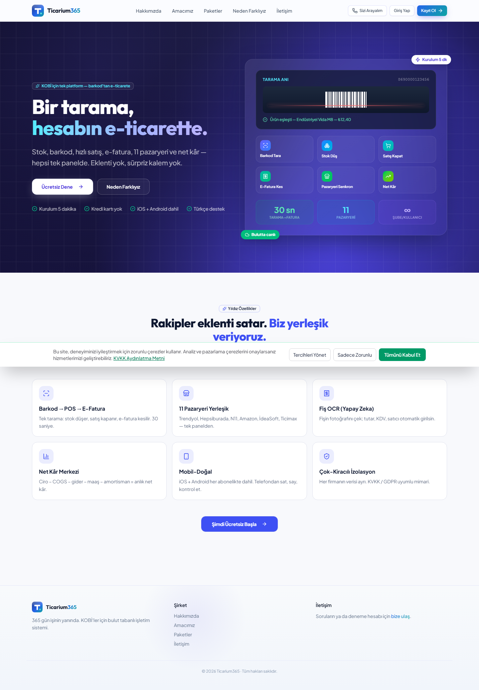

### 1.2 Giriş Sayfası

Adres: `/login`

Mevcut kullanıcıların e-posta/kullanıcı bilgileriyle sisteme giriş yaptığı ekrandır.

### 1.3 Kayıt Sayfası

Adres: `/kayit`

Yeni kullanıcı veya işletme hesabı oluşturmak için kullanılır.

### 1.4 İşletme Kaydı

Adres: `/kayit/isletme`

Satıcı/işletme hesabı açmak isteyen kullanıcıların yönlendirildiği kayıt akışıdır.

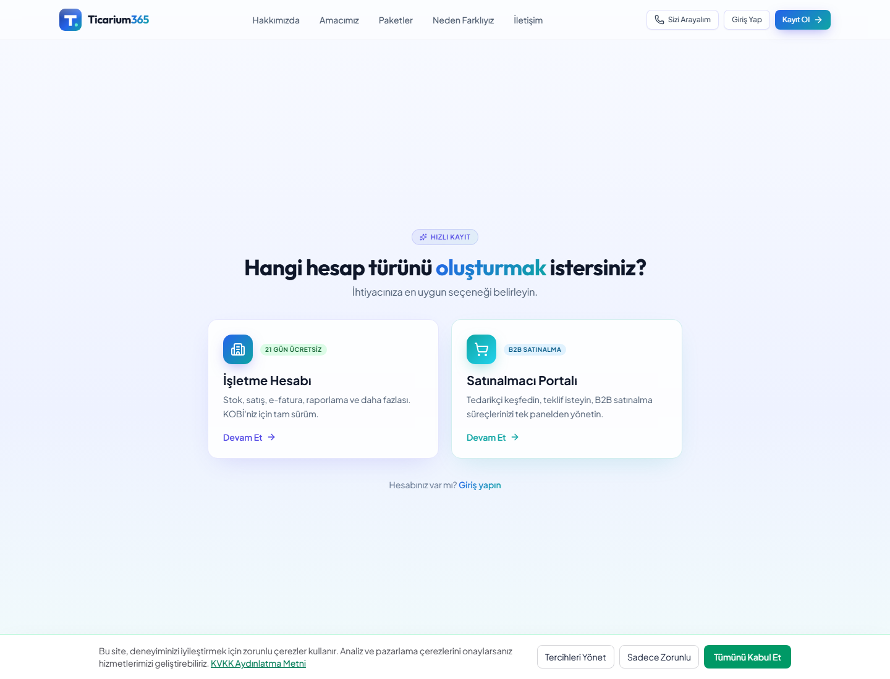

### 1.5 Satınalmacı Kaydı

Adres: `/kayit/satinalmaci`

Satınalma odaklı kullanıcıların veya firmaların kayıt akışıdır.

### 1.6 Şifremi Unuttum

Adres: `/sifremi-unuttum`

Kullanıcının hesabına erişemediği durumda parola sıfırlama sürecini başlattığı sayfadır.

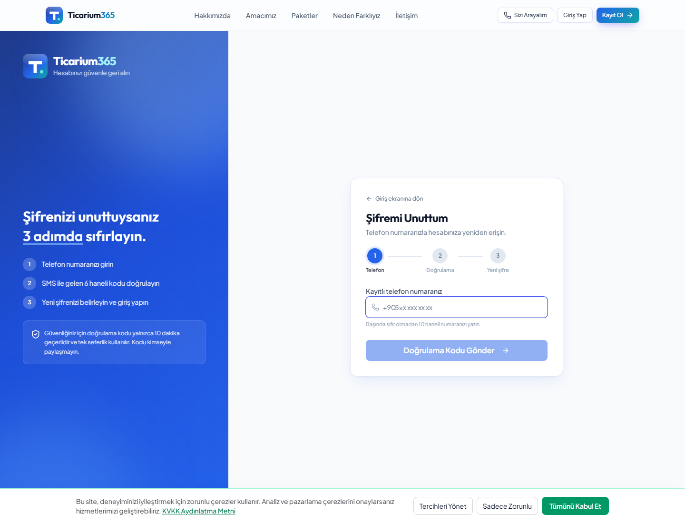

### 1.7 Karşılaştırma Sayfası

Adres: `/karsilastir`

Ticarium365’in alternatif çözümlerle farkını anlatan karar destek sayfasıdır.

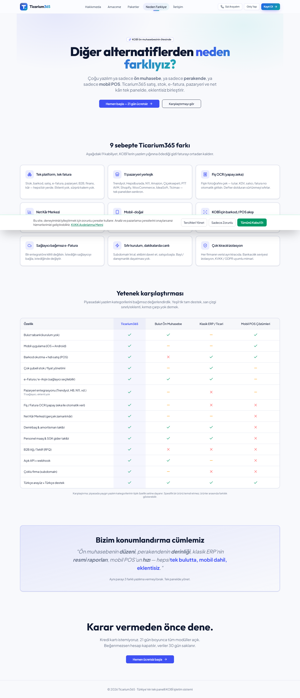

### 1.8 Hakkımızda

Adres: `/hakkimizda`

Şirket/ürün hakkında genel bilgi verir.

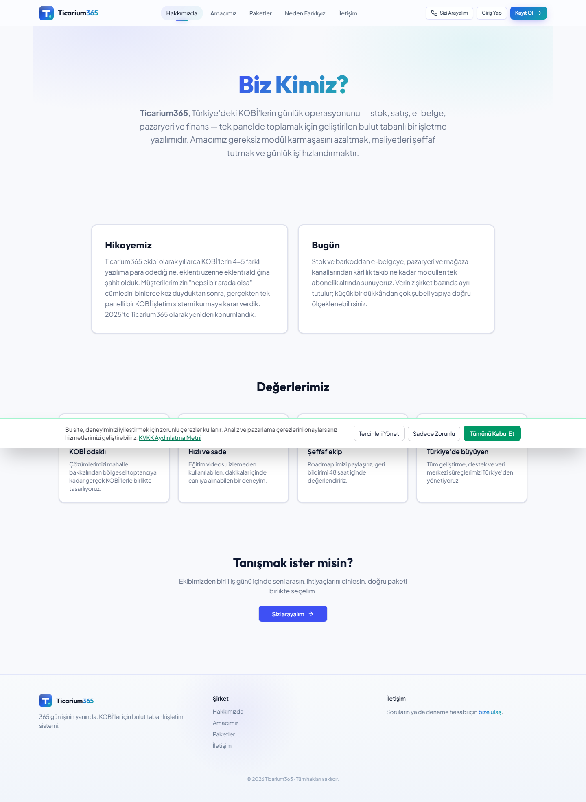

### 1.9 Amacımız

Adres: `/amacimiz`

Ürünün vizyonu, hedefi ve çözmek istediği problemi anlatır.

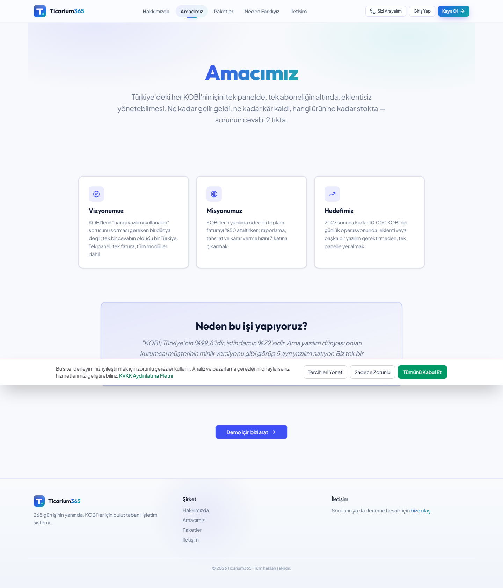

### 1.10 Paketler

Adres: `/paketler`

Paket ve plan seçeneklerini tanıtan public fiyatlandırma sayfasıdır.

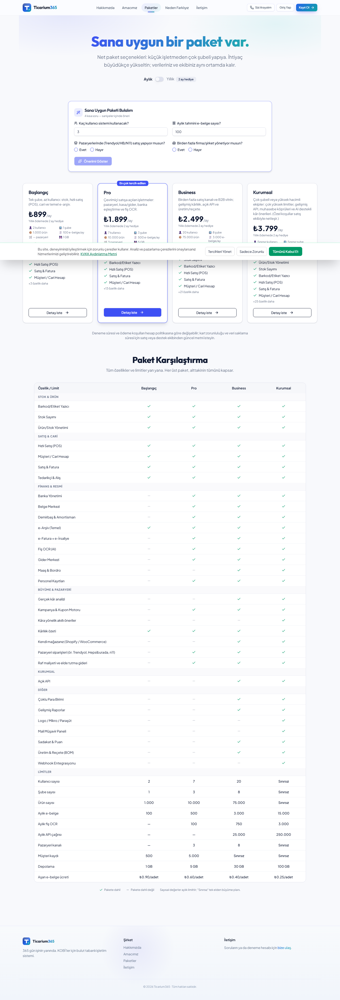

### 1.11 İletişim

Adres: `/iletisim`

Kullanıcıların işletmeyle iletişime geçmesini sağlar.

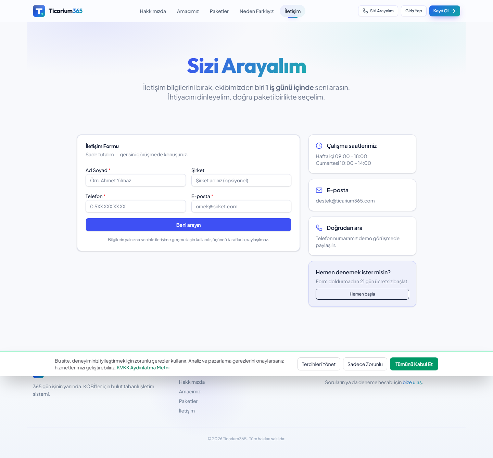

### 1.12 KVKK

Adres: `/kvkk`

Kişisel verilerin korunması ve kullanıcı bilgilendirme metinlerinin yer aldığı sayfadır.

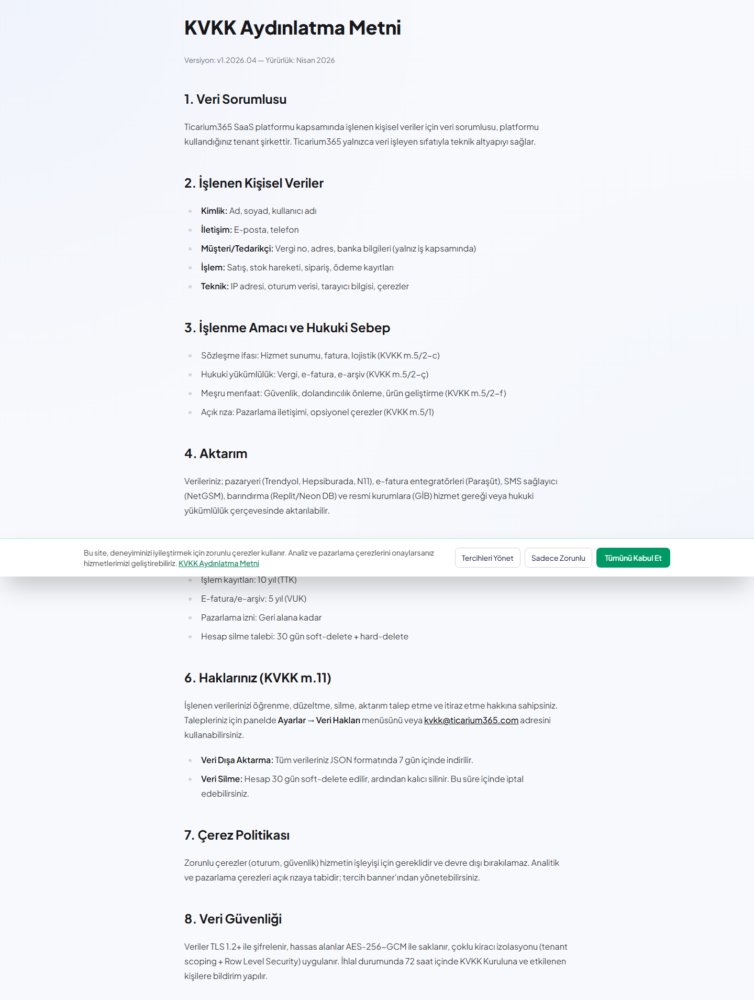

### 1.13 Ödeme Sonuç Sayfası

Adres: `/odeme/sonuc`

Ödeme dönüşlerinde kullanılan sonuç sayfasıdır. Oturum yoksa giriş sayfasına yönlenebilir.

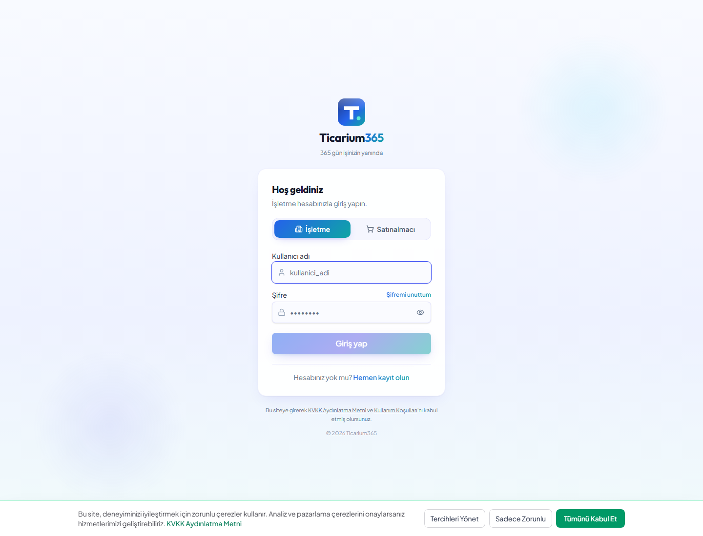

### 1.14 Pazar Sayfası

Adres: `/pazar`

Public pazar/keşif yüzeyi için ayrılmış sayfadır. Mevcut local durumda oturum gerektiren akışa yönlendi.

### 1.15 Katalog

Adres: `/catalog`

Public katalog görüntüleme yüzeyidir.

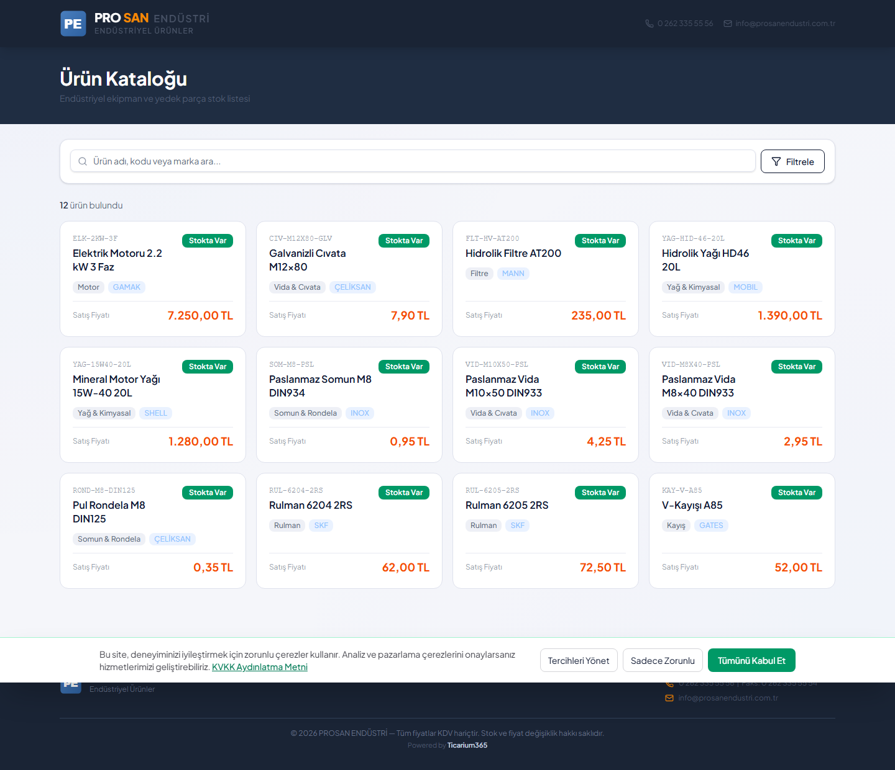

## 2. Giriş Sonrası Ekranlar

Aşağıdaki ekranlar gerçek kullanım kılavuzuna dahil edilmelidir; ancak ekran görüntüsü almak için test kullanıcıyla giriş yapılması gerekir.

### 2.1 Ana Operasyon

- `/dashboard` — Genel kontrol paneli
- `/products` — Ürün listesi
- `/products/new` — Yeni ürün ekleme
- `/products/:id` — Ürün detayı
- `/products/:id/edit` — Ürün düzenleme
- `/barcode` — Barkod tarayıcı
- `/sales` — Satış ekranı
- `/sales/history` — Satış geçmişi
- `/stock` — Stok girişi
- `/barcodes` — Barkod yönetimi
- `/stock-counts` — Stok sayımı
- `/stock-counts/:id` — Stok sayımı detayı

### 2.2 Finans ve Raporlama

- `/reports` — Raporlar
- `/reports/daily-summary` — Günlük özet
- `/finance` — Finans
- `/finance-documents` — Finans belgeleri
- `/banking` — Bankacılık
- `/finance-dashboard` — Finans paneli
- `/einvoice` — E-fatura
- `/gercek-kar` — Gerçek kâr paneli
- `/gercek-kar/ayarlar` — Gerçek kâr ayarları
- `/gercek-kar/oneriler` — Gerçek kâr önerileri
- `/profit` — Kârlılık paneli
- `/butce` — Bütçe
- `/reklam-butce` — Reklam bütçesi

### 2.3 CRM, Tedarik ve Satınalma

- `/customers` — Müşteriler
- `/customers/:id` — Müşteri detayı
- `/suppliers` — Tedarikçiler
- `/suppliers/:id` — Tedarikçi detayı
- `/purchases` — Alışlar
- `/purchases/new` — Yeni alış
- `/satinalma-merkezi` — Satınalma merkezi
- `/satinalma` — Satınalma ana sayfa
- `/satinalma/kesfet` — Satınalma keşif
- `/satinalma/rfqs` — RFQ listesi
- `/satinalma/rfqs/new` — Yeni RFQ
- `/satinalma/rfqs/:id` — RFQ detayı
- `/satinalma/inbox` — Satıcı gelen kutusu

### 2.4 B2B ve Ağ

- `/network` — Ticarium ağı
- `/network/my-profile` — Ağ profilim
- `/network/:subdomain` — Firma profili
- `/b2b/quotes` — B2B teklifler
- `/b2b/quotes/new` — Yeni teklif
- `/b2b/quotes/:id` — Teklif detayı
- `/b2b/orders` — B2B siparişler
- `/b2b/orders/:id` — Sipariş detayı
- `/b2b/catalog` — B2B katalog yönetimi
- `/b2b/vitrin` — B2B vitrin

### 2.5 E-Ticaret, Pazaryeri ve Kanallar

- `/eticarium-merkezi` — E-ticaret merkezi
- `/magaza` — Mağazalar
- `/magaza/:id` — Mağaza detayı
- `/fiyat-motoru` — Fiyat motoru
- `/kargo` — Kargo yönetimi
- `/karlilik-kanal` — Kanal kârlılığı
- `/marketplace` — Pazaryeri yönetimi
- `/channels` — Kanallar
- `/channels/bulk` — Toplu kanal işlemleri
- `/channels/:channelKey` — Kanal detayı

### 2.6 Ayarlar ve Yönetim

- `/settings` — Ayarlar
- `/firma-profili` — Firma profili
- `/settings/integrations` — Entegrasyon ayarları
- `/settings/subscription` — Abonelik
- `/settings/credit-topup` — Ek kontör
- `/settings/notifications` — Bildirim ayarları
- `/settings/menu` — Menü tercihleri
- `/kurulum-skoru` — Kurulum skoru
- `/users` — Kullanıcılar
- `/onboarding` — İlk kurulum akışı

### 2.7 Belgeler ve Operasyonel Modüller

- `/documents` — Belgeler
- `/branches` — Şubeler
- `/muhasebeci` — Muhasebeci ekranı
- `/ice-aktarim` — İçe aktarım
- `/pos` — POS
- `/uretim` — Üretim
- `/sadakat` — Sadakat
- `/doviz` — Döviz
- `/personnel` — Personel
- `/campaigns` — Kampanyalar
- `/bildirimler` — Bildirimler

### 2.8 Admin ve Super Admin

- `/super-admin` — Super admin merkezi
- `/super-admin/talepler` — İletişim talepleri
- `/super-admin/audit-logs` — Denetim günlüğü
- `/super-admin/yeni-firma` — Yeni firma oluşturma
- `/super-admin/sistem-saglik` — Sistem sağlığı
- `/super-admin/pazaryeri-saglik` — Pazaryeri sağlığı
- `/admin/musteri-doluluk` — Müşteri doluluk
- `/admin/companies` — Firmalar
- `/admin/payments` — Ödemeler
- `/admin/platform-settings` — Platform ayarları
- `/admin/billing` — Admin faturalama
- `/admin/runtime-flags` — Runtime özellik bayrakları
- `/admin/planlar` — Plan yönetimi
- `/aggregator` — Aggregator admin

## 3. Giriş Sonrası Ekran Görüntülerini Tamamlama

Bu kılavuzun ikinci aşamasında test kullanıcıyla giriş yapılır ve yukarıdaki ekranlar tek tek gezilerek ekran görüntüleri eklenir.

Gerekli bilgiler:

- Test kullanıcı e-posta/kullanıcı adı
- Test kullanıcı şifresi
- Kullanıcı rolü: tercihen `super_admin` veya tüm modülleri görebilen demo admin
- Test firması: örnek veri içeren bir firma tercih edilir

Bu bilgiler sağlandıktan sonra kılavuzun giriş sonrası bölümü ekran görüntüleriyle tamamlanacaktır.

